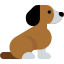

# PigeonSquare

<h2>Devoir 2 de Programmation Objet Avancée - Hiver 2018</h2>
<b>Paul Michaud et Loïc Bothorel</b>

<h3>Fonctionnement</h3>

Pour ajouter un pigeon aléatoire (mauve: biset, gris: colombin ou bleu: ramier), cliquer sur le bouton "Add random pigeon". Pour ajouter de la nourriture, il suffit de cliquer n'importe où dans la fenêtre. Enfin, il est possible de réinitialiser l'environnement avec le bouton "Reset". 

  
  
  

Par défaut, la limite de pigeons est fixée à 10 maximum et la nourriture à 5 maximum. Ces limites sont facilement modifiables dans la classe utils/Constants.

<h3>Exigences réalisées</h3>

- [x] Chaque pigeon est contrôlé par un thread.
- [x] Si rien ne se passe, les pigeons ne bougent pas.
- [x] Les pigeons se déplacent vers la nourriture la plus proche
- [x] Si un pigeon touche une nourriture pas fraiche, il l'ignore. Sinon, il la mange.
- [x] Des chiens apparaissent aléatoirement et effraient les pigeons qui s'éloignent donc du danger. La probabilité d'apparition d'un chien change à chaque tour.

  

